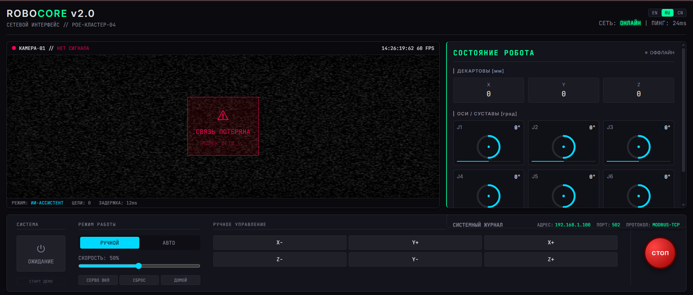
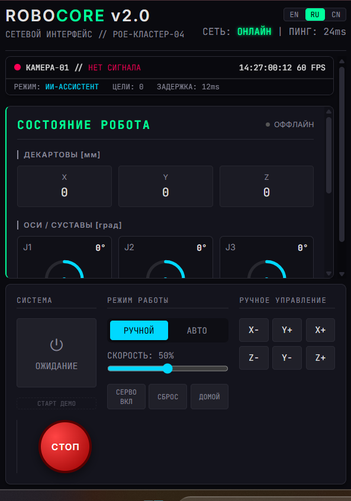

# RoboCore Interface

Local web interface for controlling the Robot Arm, designed to run on the secondary Windows 10 controller unit.

<div align="center">
  <table>
    <tr>
      <td width="70%"></td>
      <td width="30%"></td>
    </tr>
  </table>
</div>


## Features
- **Virtual Network Interface**: Simulates connection to the robot controller via PoE.
- **AI Camera Feed**: Visualizes the "AI action correction" with bounding boxes and status indicators.
- **Robot Telemetry**: Real-time display of Cartesian coordinates and Joint angles.
- **System Logs**: Tracks connection events and AI interventions.

## Setup & Run

1. Install dependencies (frontend + server):
   ```bash
   npm install
   cd server && npm install
   cd ..
   ```

2. Configure environment (optional):
   ```bash
   cp .env.example .env
   ```
   Edit `.env` to set custom robot IP, port, or proxy URL.

3. Run everything (frontend + backend server):
   ```bash
   npm start
   ```
   This starts both the WebSocket proxy server and the Vite dev server.
   Open http://localhost:5173 in your browser.

   Or run separately:
   ```bash
   npm run dev      # Frontend only
   npm run server   # Backend server only
   ```

4. Build for production:
   ```bash
   npm run build
   ```

## Technology Stack
- **Vite**
- **Vue 3** (Composition API, Script Setup)
- **TypeScript**
- **SCSS**
